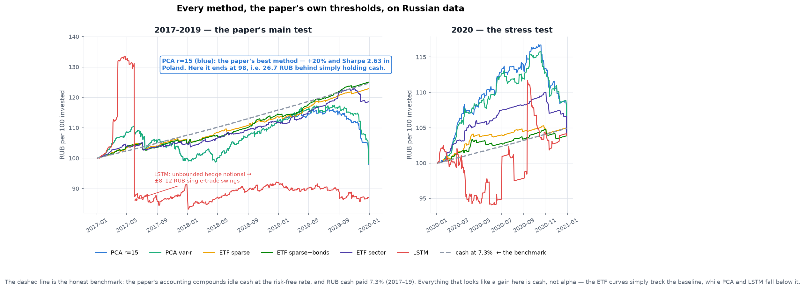
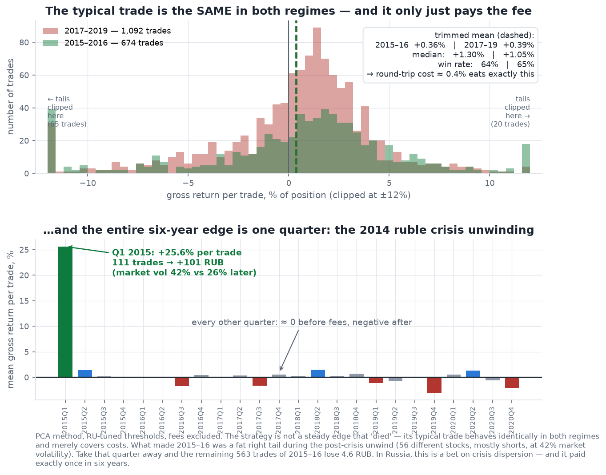

# Statistical Arbitrage on MOEX — a Russian-market replication

Replication of **Adamczyk & Dąbrowski, *Statistical Arbitrage in Polish Equities Market
Using Deep Learning Techniques*** (arXiv 2512.03073) — itself a Warsaw re-implementation
of **Avellaneda & Lee (2008)** — re-run end-to-end on the **60 most liquid Russian
stocks (MOEX), 2015–2020**, with identical windows, filters, thresholds and costs.
HSE practicum project, July 2026.

**Verdict: the pipeline transfers, the alpha does not.** Over 2017–2019 the gross
(pre-fee) edge is exactly zero, every method finishes at or below the RUB cash
baseline, and the paper's method ranking fully inverts. The one profitable stretch,
2015–2016, turns out to be a single quarter of post-crisis dispersion (Q1 2015),
not an edge.

| 2017–2019 | Poland (paper) | Russia (this repo) |
|---|---|---|
| PCA eigenportfolios | **+20%**, Sharpe up to 2.63 — best | −2.1%, **−26.7 ₽ vs cash**; gross edge −0.1 ₽ on 1,092 trades |
| LSTM (the paper's novelty) | ≈+10% | −12.9%, **−37.4 ₽ vs cash** — worst |
| ETF / index factors | ≈+5% — weakest | ≈ cash (α −6…+0.4 ₽) |
| 2020 stress | PCA blows up, only ETFs profit | nothing blows up, nothing profits (±1.4 ₽ of cash) |



The sharpest finding: the strategy's *typical* trade is statistically identical in both
regimes (trimmed mean ≈ +0.4% gross ≈ its own round-trip cost, win rate 64–65%). The
entire six-year edge is one fat tail — Q1 2015's 111 trades made +101 ₽ while the other
563 trades of 2015–16 *lost* money. On MOEX this is a bet on crisis dispersion that
paid exactly once.



## Read this first

- **[statarb_moex_report.pdf](statarb_moex_report.pdf)** — 8-page self-contained report
- **[replication_steps.ipynb](replication_steps.ipynb)** — the whole recreation, step by
  step, with executed outputs (runs offline from the cached `data/` in ~2 min)
- **[RESULTS.md](RESULTS.md)** — full written results and caveats
- **[RU_ADAPTATION.md](RU_ADAPTATION.md)** — every Polish→Russian mapping decision
- **[REPLICATION_SPEC.md](REPLICATION_SPEC.md)** — the source paper distilled to a
  parameter-complete spec (written so the paper itself never needs re-reading)

## Quickstart

```bash
pip install -r requirements.txt
jupyter lab replication_steps.ipynb     # everything runs from cached data/ + results/
```

Full rebuild from zero (public endpoints only — no API keys):

```bash
python3 moex_data.py        # ~20 min of MOEX ISS + dohod.ru requests, cached stepwise
python3 test_synthetic.py   # engine sanity: synthetic OU market where the model is TRUE
python3 run_experiments.py  # transfer test + 2015-16 threshold grid + reruns -> results/
python3 run_lstm.py         # LSTM: ~4 h, 240 stock-year models (cached, resumable)
python3 make_figures.py     # figures/*.png
```

## Repo map

| File | Role |
|---|---|
| `statarb_pipeline.py` | market-agnostic engine: factor models → residual → OU/AR(1) → s-score → backtest (two-stage: signal panels, then a fast state machine) |
| `moex_data.py` | MOEX data layer: ISS candles/indices/compositions/zcyc, dohod.ru dividends, dividend adjustment with split basis factors |
| `lstm_factors.py` | per-stock 2-layer LSTM replicating portfolio (spec §3B) |
| `run_experiments.py` / `run_lstm.py` | experiment drivers → `results/` |
| `test_synthetic.py` | validation on synthetic OU data (caught a real P&L-formula bug) |
| `check_data.py` | post-fetch data sanity checks |
| `make_figures.py` / `make_notebook.py` / `make_pdf.py` | deliverable generators |
| `data/` | cached inputs: adjusted prices, indices, dividends, OFZ yields, universe |
| `results/` | all backtest outputs incl. LSTM equity curves and RU-tuned thresholds |
| `figures/` | 8 annotated figures ([index](figures/README.md)) |

Not in the repo (regenerable): `data/lstm/` — 65 MB of trained model weights
(`run_lstm.py` rebuilds them; their backtest outputs are preserved in `results/`).

## Two data traps worth knowing (if you build on MOEX data)

1. **ISS candles are retroactively split-adjusted; dividends are as-paid per old
   share.** GMKN/TRNFP 1:100 (2024), PLZL 1:10 (2025), VTBR 5000:1 (2024) — dividends
   must be rescaled by the candle/as-traded price ratio (`fetch_basis_factors`).
2. **ISS dividend history is incomplete before ~2018** (SBER starts 2019) — merged here
   with dohod.ru per-payment records, applied on T+2 ex-dates.

## Known limitations

Fixed 60-name universe (survivorship — flatters results, so the negative verdict is
conservative) · no borrow fees (matters for the short-heavy 2015–16 P&L) · sector/SMID
indices not directly investable pre-2018 (the paper splices the same way) · fees charged
on net replica notional per the paper's formula, while the gross book is 2–3× larger ·
Sharpe uses the paper's realized-only equity convention.

## References

- M. Adamczyk, M. Dąbrowski — *Statistical Arbitrage in Polish Equities Market Using
  Deep Learning Techniques*, arXiv 2512.03073
- M. Avellaneda, J.-H. Lee — *Statistical Arbitrage in the U.S. Equities Market* (2008)
